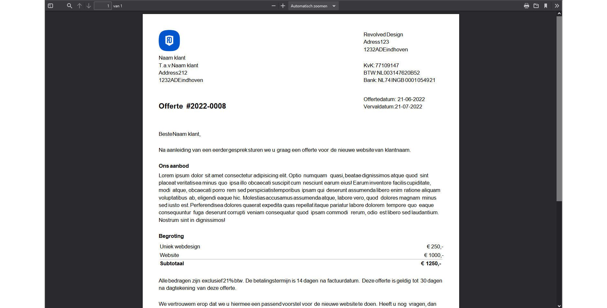

# PDF Generator
## The goal
The purpose of this proof of concept is to generate a PDF file from HTML with a downloadable link in React. This can later be used in my personal project to generate invoices.

## How it works
The first step is to create a invoice with styling `(Template.tsx and template.scss)`. This file will be used to create the PDF. The PDF will be generated as `blob` and can be downloaded. The library that I used is `jspdf`.

First you'll have to insert the invoice component `(Template.tsx)` into the `App.tsx` file.
```jsx
<Template height={pdfPX.height} width={pdfPX.width}/>
```

Next you'll have to create a function in the `useEffect` that will be called when the component is mounted. This function will create the PDF. It will also create a link that will be used to download the PDF. `setHref` is a state that will be used to create the link.
```jsx
const doc = document.getElementById('template');
pdf.html(doc!.innerHTML, {
    x: 0,
    y: 0,
    width: pdfPX.width,
    callback: function (pdf) {
        blobUrl = pdf.output('bloburl')
        setHref(blobUrl);
    }
});
```

If the `href` is set, the iframe will be rendered with the PDF.
```jsx
{ href === '' ? <div>Laden...</div> : <iframe src={href} height={window.innerHeight} width={window.innerWidth - 300}></iframe>}
```

## Example
The following is an example of how the PDF will look like. You can visit the [working GitHub Page](https://nsmnia.github.io/react-pdf/) or see the example below.

